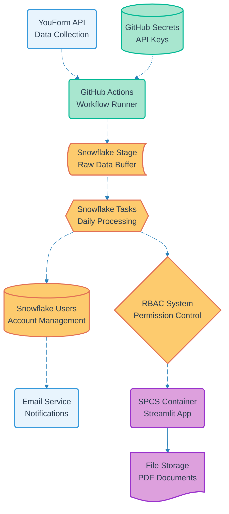

# Pipeline 01: User Registration

## Overview
Critical user onboarding pipeline that creates Snowflake accounts via external form submission. Implements cost-optimized data flow pattern using GitHub Actions as API proxy and Snowflake Stages as buffer layer. Handles GDPR compliance for minors and implements role-based access control.

## LEGO Reference Table

| **Field** | **Value** |
|-----------|-----------|
| **Pipeline ID** | `01` |
| **Category** | User Management & Data Capture |
| **Priority** | Very High |
| **Connects To** | `02` (Authentication), `04` (Parental Consent), `13` (Container Lifecycle) |
| **Triggered By** | YouForm webhook |
| **Outputs To** | Snowflake Users, RBAC, Email Service |

## Stack Architecture

## Definition of Done (DoD)

| **Criteria** | **Validation Method** |
|--------------|----------------------|
| **Age Validation** | GDPR compliance enforced - users <14 blocked |
| **Form Processing** | GitHub workflow executes within 30 seconds |
| **Stage Upload** | Data successfully uploaded to Snowflake Stage |
| **Account Creation** | Snowflake user created with correct RBAC role |
| **Email Delivery** | Welcome email sent with credentials |
| **Consent Flow** | Minors (14-17) redirected to consent upload |
| **Error Handling** | Failed workflows queued for manual review |
| **Retry Logic** | Maximum 3 retry attempts with exponential backoff |

## Technical Implementation Notes

### Cost Optimization Pattern
GitHub Actions serves as economic API proxy to minimize external service costs. Snowflake Stages buffer data for daily batch processing instead of real-time table writes.

### RBAC Assignment Logic
- **Participants**: READ access to course materials and certificate generation
- **Volunteers**: WRITE access for content creation and slide generation tools

### Error Recovery Strategy
- Form validation errors return specific messages
- GitHub workflow failures trigger manual review queue
- Snowflake processing errors auto-retry with backoff
