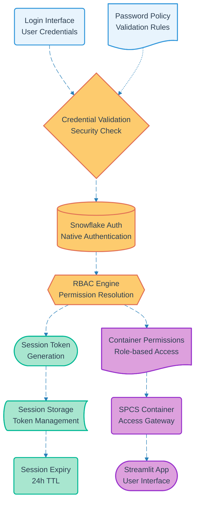

# Pipeline 02: User Authentication

## Overview
Core authentication pipeline that validates user credentials against Snowflake's native authentication system. Implements session management with RBAC validation and container access provisioning. Handles password policies and security controls for both participants and volunteers.

## LEGO Reference Table

| **Field** | **Value** |
|-----------|-----------|
| **Pipeline ID** | `02` |
| **Category** | User Management & Data Capture |
| **Priority** | High |
| **Connects To** | `13` (Container Lifecycle), `03` (Account Deletion), `05` (Course Proposal), `10` (Event Check-in) |
| **Triggered By** | User login attempt |
| **Outputs To** | Session token, Container access, RBAC validation |

## Stack Architecture

## Definition of Done (DoD)

| **Criteria** | **Validation Method** |
|--------------|----------------------|
| **Credential Validation** | Snowflake native auth validates user/password |
| **Password Policy** | Complex password rules enforced |
| **RBAC Resolution** | Correct role permissions assigned |
| **Session Generation** | Valid JWT token created with expiry |
| **Container Access** | User can access SPCS Streamlit interface |
| **Session Expiry** | 24-hour TTL enforced automatically |
| **Role Separation** | Participant vs Volunteer access differentiated |
| **Security Logging** | Authentication attempts logged for audit |

## Technical Implementation Notes

### Snowflake Native Authentication
Leverages Snowflake's built-in user management and authentication system. No external identity providers required, reducing complexity and attack surface while maintaining enterprise-grade security controls.

### RBAC Permission Model
- **Participants**: READ access to course materials, certificate downloads, survey completion
- **Volunteers**: WRITE access for course creation, slide generation, legal document access, content management tools

### Session Security Strategy
JWT tokens with 24-hour expiration stored in secure session storage. Automatic renewal on active usage with sliding window expiration to balance security and user experience.

### Error Recovery Strategy
- Invalid credentials return specific error messages without revealing user existence
- Account lockout after multiple failed attempts with exponential backoff
- Session corruption triggers automatic re-authentication flow
