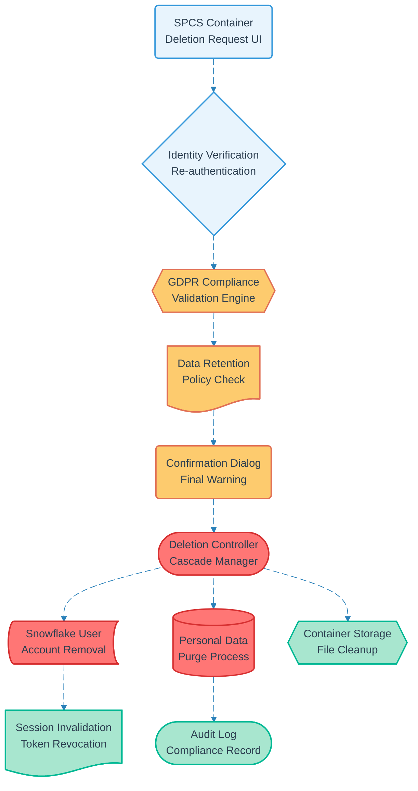

# Pipeline 03: Account Deletion

## Overview
User-initiated account deletion pipeline that ensures complete data cleanup and compliance with GDPR Article 17 (Right to Erasure). Implements cascading deletion across all system components while maintaining audit trails for regulatory compliance.

## LEGO Reference Table

| **Field** | **Value** |
|-----------|-----------|
| **Pipeline ID** | `03` |
| **Category** | User Management & Data Capture |
| **Priority** | High |
| **Connects To** | None (Terminal pipeline) |
| **Triggered By** | Authenticated user deletion request |
| **Outputs To** | Account cleanup confirmation, Compliance audit log |

## Stack Architecture

## Definition of Done (DoD)

| **Criteria** | **Validation Method** |
|--------------|----------------------|
| **Identity Verification** | User re-authenticates with current credentials |
| **GDPR Compliance** | Article 17 requirements validated |
| **Data Retention Check** | Legal retention periods respected |
| **User Confirmation** | Final deletion warning acknowledged |
| **Account Removal** | Snowflake user account deleted |
| **Data Purge** | All personal data removed from tables |
| **File Cleanup** | Container storage files deleted |
| **Session Invalidation** | All active sessions terminated |
| **Audit Trail** | Deletion event logged for compliance |

## Technical Implementation Notes

### GDPR Article 17 Compliance
Implements complete right to erasure while respecting legal retention requirements. Personal data is immediately purged while anonymized aggregate data may be retained for legitimate business interests.

### Cascading Deletion Strategy
Systematic removal across all system components in dependency order. Snowflake user deletion triggers automatic cleanup of associated records while maintaining referential integrity.

### Irreversibility Controls
Multiple confirmation steps with clear warnings about permanent data loss. Re-authentication required to prevent accidental deletions from compromised sessions or social engineering attacks.

### Error Recovery Strategy
- Failed deletions trigger rollback to previous state
- Partial deletions continue from last successful checkpoint
- Manual intervention required only for system-level failures
