# Pipeline 04: Parental Consent Upload

## Overview
GDPR-compliant parental consent management for users aged 14-17. Implements secure PDF upload, digital signature validation, and compliance record keeping within SPCS container environment. Critical for legal operation with minor participants.

## LEGO Reference Table

| **Field** | **Value** |
|-----------|-----------|
| **Pipeline ID** | `04` |
| **Category** | User Management & Data Capture |
| **Priority** | Very High |
| **Connects To** | `13` (Container Lifecycle) |
| **Triggered By** | Minor user registration completion |
| **Outputs To** | Compliance record, Full system access unlock |

## Stack Architecture

```mermaid
%%{init: {'theme':'base', 'themeVariables': {'primaryColor':'#f0f8ff','primaryTextColor':'#2c3e50','primaryBorderColor':'#3498db','lineColor':'#2980b9','secondaryColor':'#e8f4fd','tertiaryColor':'#d5e8f3','background':'#ffffff','mainBkg':'#f0f8ff','secondBkg':'#e1f0ff','tertiaryBkg':'#d1e7ff'}}}%%
flowchart TD
    %% Entry Point Layer
    A@{ shape: rounded, label: "SPCS Container<br/>Streamlit Upload UI" }
    B@{ shape: diam, label: "Age Verification<br/>14-17 Range Check" }
    
    %% Upload Processing Layer
    C@{ shape: doc, label: "PDF Upload<br/>File Handler" }
    D@{ shape: hex, label: "File Validation<br/>Format & Size Check" }
    E@{ shape: rounded, label: "Digital Signature<br/>Verification Engine" }
    
    %% Content Validation Layer
    F@{ shape: stadium, label: "Parent Information<br/>Extraction & Validation" }
    G@{ shape: diam, label: "Legal Requirements<br/>Compliance Check" }
    H@{ shape: bow-rect, label: "Document Storage<br/>Secure File System" }
    
    %% Compliance Recording Layer
    I@{ shape: cyl, label: "Compliance Database<br/>Legal Record" }
    J@{ shape: hex, label: "Access Control<br/>Permission Update" }
    K@{ shape: stadium, label: "System Access<br/>Full Unlock" }
    
    %% Critical Consent Flow
    A e1@--> B
    B e2@--> C
    C e3@--> D
    D e4@--> E
    E e5@--> F
    F e6@--> G
    G e7@--> H
    H e8@--> I
    I e9@--> J
    J e10@--> K
    
    %% Animation for Legal Operations
    e1@{ animation: fast }
    e2@{ animation: fast }
    e3@{ animation: fast }
    e4@{ animation: slow }
    e5@{ animation: slow }
    e6@{ animation: fast }
    e7@{ animation: fast }
    e8@{ animation: slow }
    e9@{ animation: fast }
    e10@{ animation: fast }
    
    %% Styling
    classDef entry fill:#e8f4fd,stroke:#3498db,stroke-width:2px
    classDef upload fill:#fdcb6e,stroke:#e17055,stroke-width:2px
    classDef validation fill:#dda0dd,stroke:#9932cc,stroke-width:2px
    classDef compliance fill:#a8e6cf,stroke:#00b894,stroke-width:2px
    classDef critical stroke-dasharray: 5,5,stroke-dashoffset: 10,animation: dash 2s linear infinite
    
    class A,B entry
    class C,D,E upload
    class F,G,H validation
    class I,J,K compliance
    class e4,e5,e8 critical
```

## Definition of Done (DoD)

| **Criteria** | **Validation Method** |
|--------------|----------------------|
| **Age Range Validation** | User confirmed to be 14-17 years old |
| **PDF Format Check** | Valid PDF document uploaded |
| **File Size Limits** | Document within acceptable size parameters |
| **Digital Signature** | Valid parental signature detected |
| **Parent Information** | Complete parent contact details extracted |
| **Legal Compliance** | All GDPR consent requirements met |
| **Secure Storage** | Document stored in encrypted container storage |
| **Compliance Record** | Legal record created in compliance database |
| **Access Update** | User permissions upgraded to full access |

## Technical Implementation Notes

### GDPR Article 8 Compliance
Implements specific requirements for processing personal data of children under 16. Ensures verifiable parental consent with appropriate safeguards for data protection and privacy rights.

### Digital Signature Validation
Advanced PDF signature verification to ensure document integrity and authenticity. Supports common digital signature formats while maintaining strict validation criteria for legal compliance.

### Secure Container Storage
Documents stored within SPCS container with encryption at rest. Access restricted to authorized compliance personnel with full audit logging for regulatory inspection requirements.

### Error Recovery Strategy
- Invalid PDF formats return specific guidance for document preparation
- Missing signatures trigger re-upload with signature requirement highlights
- Storage failures maintain upload session for retry without data loss
