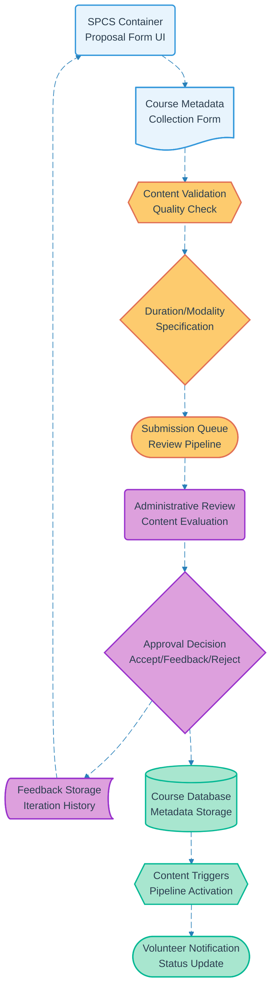

# Pipeline 05: Course Proposal Evaluation

## Overview
Iterative course proposal workflow for volunteers to submit, receive feedback, and refine course offerings. Implements approval system with duration/modality tracking and integration with downstream content generation pipelines.

## LEGO Reference Table

| **Field** | **Value** |
|-----------|-----------|
| **Pipeline ID** | `05` |
| **Category** | User Management & Data Capture |
| **Priority** | Medium |
| **Connects To** | `06` (Course Certification), `07` (Course Slides), `09` (Social Media), `21` (Eventbrite) |
| **Triggered By** | Authenticated volunteer submission |
| **Outputs To** | Approval status, Course metadata, Content generation triggers |

## Stack Architecture

## Definition of Done (DoD)

| **Criteria** | **Validation Method** |
|--------------|----------------------|
| **Volunteer Authentication** | Valid volunteer role verified |
| **Complete Metadata** | All required course fields populated |
| **Content Quality** | Educational content meets standards |
| **Duration Specification** | Clear timeline and session structure |
| **Modality Definition** | Delivery method clearly specified |
| **Administrative Review** | Proposal evaluated by qualified reviewer |
| **Decision Recording** | Approval/feedback/rejection documented |
| **Database Storage** | Approved courses stored with metadata |
| **Pipeline Triggers** | Downstream content generation activated |
| **Notification Delivery** | Volunteer informed of decision status |

## Technical Implementation Notes

### Iterative Feedback Loop
Supports multiple revision cycles with structured feedback to improve course quality. Maintains version history of proposals to track improvement progression and reviewer effectiveness.

### Quality Assurance Framework
Multi-criteria evaluation including educational value, target audience appropriateness, resource requirements, and alignment with Circle Up mission and pedagogical standards.

### Metadata Standardization
Structured course information capture for consistent downstream processing. Enables automated content generation, scheduling integration, and marketing material creation.

### Error Recovery Strategy
- Incomplete submissions auto-save progress for later completion
- Review timeouts trigger escalation to senior administrators
- System failures preserve submission data with manual review fallback
