# Pipeline 06: Course Certification

## Overview
Automated certificate generation pipeline triggered by NPS survey completion. Integrates with Snowflake data, GitHub templates, and Weasyprint rendering to produce personalized PDF certificates. Implements quality gates to ensure participant satisfaction before certificate unlock.

## LEGO Reference Table

| **Field** | **Value** |
|-----------|-----------|
| **Pipeline ID** | `06` |
| **Category** | Content Generation & Document |
| **Priority** | High |
| **Connects To** | `12` (Meeting Reminders) |
| **Triggered By** | NPS survey completion (Pipeline 11) |
| **Outputs To** | PDF certificate download, Participant completion record |

## Stack Architecture

```mermaid
%%{init: {'theme':'base', 'themeVariables': {'primaryColor':'#f0f8ff','primaryTextColor':'#2c3e50','primaryBorderColor':'#3498db','lineColor':'#2980b9','secondaryColor':'#e8f4fd','tertiaryColor':'#d5e8f3','background':'#ffffff','mainBkg':'#f0f8ff','secondBkg':'#e1f0ff','tertiaryBkg':'#d1e7ff'}}}%%
flowchart TD
    %% Trigger Layer
    A@{ shape: stadium, label: "NPS Survey<br/>Completion Signal" }
    B@{ shape: diam, label: "Quality Gate<br/>NPS ≥4.2 Check" }
    
    %% Data Gathering Layer
    C@{ shape: bow-rect, label: "Snowflake Stage<br/>Participant Data" }
    D@{ shape: cyl, label: "Course Metadata<br/>Event Information" }
    E@{ shape: hex, label: "Data Aggregation<br/>Certificate Variables" }
    
    %% Template Processing Layer
    F@{ shape: doc, label: "GitHub Repository<br/>Certificate Templates" }
    G@{ shape: rounded, label: "Template Engine<br/>Variable Substitution" }
    H@{ shape: stadium, label: "Container Volumes<br/>Template Loading" }
    
    %% Rendering Layer
    I@{ shape: hex, label: "Weasyprint Engine<br/>PDF Generation" }
    J@{ shape: doc, label: "PDF Output<br/>Certificate Document" }
    K@{ shape: rounded, label: "Download Interface<br/>User Access" }
    
    %% Certificate Generation Flow
    A e1@--> B
    B e2@--> C
    C e3@--> D
    D e4@--> E
    E e5@--> F
    F e6@--> G
    G e7@--> H
    H e8@--> I
    I e9@--> J
    J e10@--> K
    
    %% Animation for Critical Operations
    e1@{ animation: fast }
    e2@{ animation: slow }
    e3@{ animation: fast }
    e4@{ animation: fast }
    e5@{ animation: fast }
    e6@{ animation: fast }
    e7@{ animation: fast }
    e8@{ animation: slow }
    e9@{ animation: slow }
    e10@{ animation: fast }
    
    %% Styling
    classDef trigger fill:#e8f4fd,stroke:#3498db,stroke-width:2px
    classDef data fill:#a8e6cf,stroke:#00b894,stroke-width:2px
    classDef template fill:#fdcb6e,stroke:#e17055,stroke-width:2px
    classDef render fill:#dda0dd,stroke:#9932cc,stroke-width:2px
    classDef critical stroke-dasharray: 5,5,stroke-dashoffset: 10,animation: dash 2s linear infinite
    
    class A,B trigger
    class C,D,E data
    class F,G,H template
    class I,J,K render
    class e2,e8,e9 critical
```

## Definition of Done (DoD)

| **Criteria** | **Validation Method** |
|--------------|----------------------|
| **NPS Threshold** | Survey score ≥4.2 verified before generation |
| **Data Completeness** | All participant and course data available |
| **Template Loading** | GitHub template successfully retrieved |
| **Variable Substitution** | Personalization data correctly inserted |
| **PDF Generation** | Weasyprint renders valid PDF document |
| **Quality Validation** | Certificate passes visual and content checks |
| **Download Availability** | PDF accessible through container interface |
| **Completion Record** | Participant achievement logged in database |

## Technical Implementation Notes

### Quality-Gated Generation
Certificate generation only proceeds after NPS score validation ensures participant satisfaction. Maintains program quality standards while preventing certificate farming from unsatisfied participants.

### Template Version Control
GitHub-based template management enables rapid certificate design updates and A/B testing. Version control ensures consistency while allowing iterative improvements based on participant feedback.

### Personalization Engine
Dynamic variable substitution includes participant name, course title, completion date, instructor information, and custom program branding for professional certificate appearance.

### Error Recovery Strategy
- NPS threshold failures provide feedback guidance for course improvement
- Template loading errors fall back to previous version with notification
- PDF generation failures retry with simplified template format
