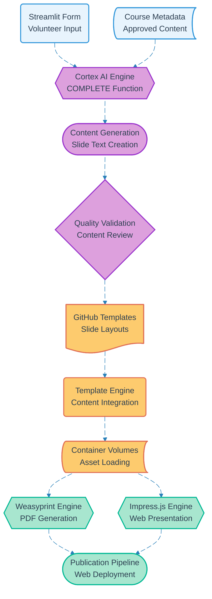

# Pipeline 07: Course Slides Generation

## Overview
AI-powered slide generation pipeline combining volunteer input forms with Snowflake Cortex AI to create personalized course presentations. Supports multiple output formats (Weasyprint PDF, Impress.js web) with automated web publication for broader accessibility.

## LEGO Reference Table

| **Field** | **Value** |
|-----------|-----------|
| **Pipeline ID** | `07` |
| **Category** | Content Generation & Document |
| **Priority** | Medium |
| **Connects To** | `20` (Slide Web Publication) |
| **Triggered By** | Course approval (Pipeline 05) + AI content (Pipeline 18) |
| **Outputs To** | PDF slides, Web presentation, Published content |

## Stack Architecture

## Definition of Done (DoD)

| **Criteria** | **Validation Method** |
|--------------|----------------------|
| **Form Completion** | All required volunteer input fields populated |
| **Course Data** | Approved course metadata available |
| **AI Generation** | Cortex AI produces coherent slide content |
| **Content Quality** | Generated text meets educational standards |
| **Template Loading** | GitHub templates successfully retrieved |
| **PDF Rendering** | Weasyprint generates valid PDF slides |
| **Web Generation** | Impress.js creates interactive presentation |
| **Web Publication** | Slides deployed to accessible web interface |
| **Volunteer Access** | Creator can download and access presentations |

## Technical Implementation Notes

### AI-Driven Content Creation
Snowflake Cortex AI COMPLETE function processes volunteer inputs and course context to generate educationally appropriate slide content. Maintains consistency with approved course objectives while personalizing delivery style.

### Multi-Format Output Strategy
Dual rendering pipeline supports both traditional PDF downloads for offline use and modern web presentations for interactive delivery. Format selection based on course delivery method and volunteer preference.

### Template Agnostic Design
GitHub-based template system supports multiple slide frameworks. Easy migration from Weasyprint to Impress.js or integration with Gamma.ai for enhanced visual generation capabilities.

### Error Recovery Strategy
- AI generation failures fall back to template-only slides with placeholder content
- PDF rendering errors retry with simplified layouts
- Web generation failures maintain PDF availability while troubleshooting
