# Pipeline 08: Volunteer Legal Documents

## Overview
On-demand legal document generation for volunteers including confidentiality agreements, conduct policies, and compliance documentation. Utilizes GitHub template repository with Weasyprint rendering for professional PDF output within container environment.

## LEGO Reference Table

| **Field** | **Value** |
|-----------|-----------|
| **Pipeline ID** | `08` |
| **Category** | Content Generation & Document |
| **Priority** | Medium |
| **Connects To** | `13` (Container Lifecycle) |
| **Triggered By** | Authenticated volunteer document request |
| **Outputs To** | PDF legal documents, Compliance record, Download interface |

## Stack Architecture

```mermaid
%%{init: {'theme':'base', 'themeVariables': {'primaryColor':'#f0f8ff','primaryTextColor':'#2c3e50','primaryBorderColor':'#3498db','lineColor':'#2980b9','secondaryColor':'#e8f4fd','tertiaryColor':'#d5e8f3','background':'#ffffff','mainBkg':'#f0f8ff','secondBkg':'#e1f0ff','tertiaryBkg':'#d1e7ff'}}}%%
flowchart TD
    %% Request Layer
    A@{ shape: rounded, label: "SPCS Container<br/>Document Request UI" }
    B@{ shape: diam, label: "Volunteer Validation<br/>Role Verification" }
    
    %% Document Selection Layer
    C@{ shape: doc, label: "Document Catalog<br/>Legal Templates" }
    D@{ shape: hex, label: "Template Selection<br/>Document Type" }
    E@{ shape: stadium, label: "Personalization Data<br/>Volunteer Information" }
    
    %% Template Processing Layer
    F@{ shape: doc, label: "GitHub Repository<br/>Legal Templates" }
    G@{ shape: rounded, label: "Template Engine<br/>Variable Substitution" }
    H@{ shape: bow-rect, label: "Container Volumes<br/>Template Loading" }
    
    %% Generation Layer
    I@{ shape: hex, label: "Weasyprint Engine<br/>PDF Generation" }
    J@{ shape: cyl, label: "Compliance Database<br/>Generation Record" }
    K@{ shape: stadium, label: "Download Interface<br/>Secure Access" }
    
    %% Legal Document Flow
    A e1@--> B
    B e2@--> C
    C e3@--> D
    D e4@--> E
    E e5@--> F
    F e6@--> G
    G e7@--> H
    H e8@--> I
    I e9@--> J
    J e10@--> K
    
    %% Animation for Security Operations
    e1@{ animation: fast }
    e2@{ animation: slow }
    e3@{ animation: fast }
    e4@{ animation: fast }
    e5@{ animation: fast }
    e6@{ animation: fast }
    e7@{ animation: fast }
    e8@{ animation: slow }
    e9@{ animation: fast }
    e10@{ animation: fast }
    
    %% Styling
    classDef request fill:#e8f4fd,stroke:#3498db,stroke-width:2px
    classDef selection fill:#fdcb6e,stroke:#e17055,stroke-width:2px
    classDef template fill:#a8e6cf,stroke:#00b894,stroke-width:2px
    classDef generation fill:#dda0dd,stroke:#9932cc,stroke-width:2px
    classDef critical stroke-dasharray: 5,5,stroke-dashoffset: 10,animation: dash 2s linear infinite
    
    class A,B request
    class C,D,E selection
    class F,G,H template
    class I,J,K generation
    class e2,e8 critical
```

## Definition of Done (DoD)

| **Criteria** | **Validation Method** |
|--------------|----------------------|
| **Volunteer Authentication** | Valid volunteer role verified |
| **Document Authorization** | User authorized for requested document type |
| **Template Availability** | Required legal template exists in repository |
| **Data Personalization** | Volunteer information correctly substituted |
| **Legal Compliance** | Document meets current legal requirements |
| **PDF Generation** | Weasyprint produces valid, formatted document |
| **Compliance Logging** | Document generation recorded for audit |
| **Secure Download** | PDF available through authenticated interface |

## Technical Implementation Notes

### Legal Template Management
GitHub-based version control ensures legal documents remain current with regulatory changes. Template updates automatically propagate to all future generations while maintaining audit trail for compliance verification.

### Role-Based Document Access
Different volunteer roles receive appropriate legal documentation. Advanced volunteers may access additional agreements while basic volunteers receive standard onboarding documents only.

### Compliance Audit Trail
Complete generation logging including user identity, document type, generation timestamp, and template version for regulatory compliance and legal protection during program audits.

### Error Recovery Strategy
- Authentication failures redirect to login with return-to-document flow
- Missing templates trigger admin notification with fallback to generic versions
- PDF generation errors retry with simplified formatting while preserving legal content
