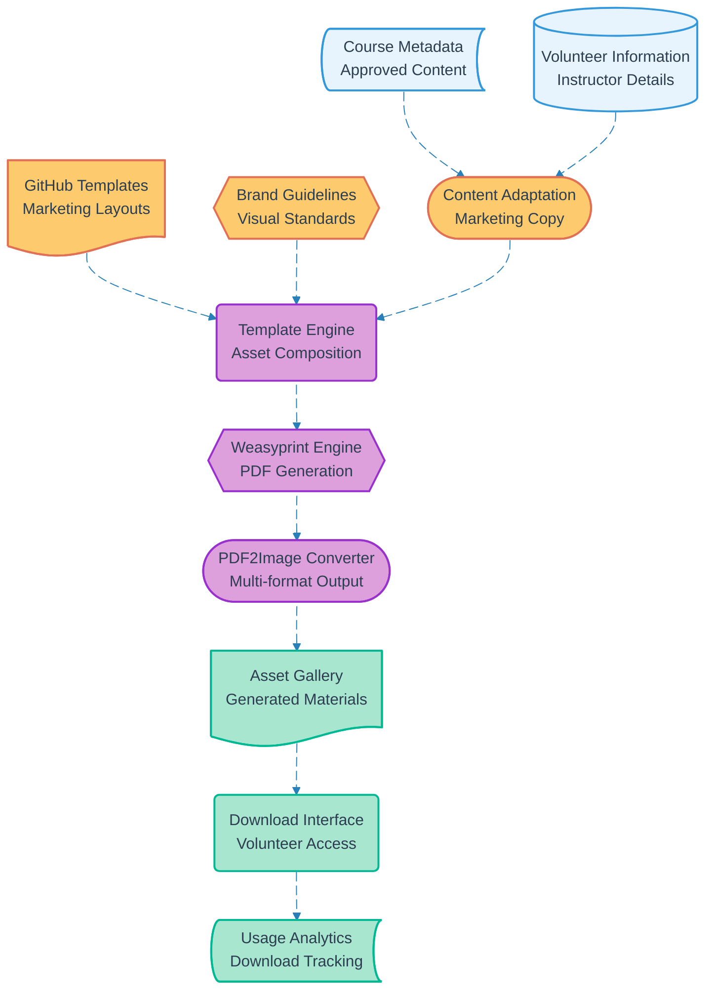

# Pipeline 09: Social Media Assets

## Overview
Marketing asset generation pipeline that transforms approved course metadata into promotional materials. Utilizes course information to create PDF marketing documents, converts to images via PDF2Image, and provides download interface for volunteer-driven social media promotion.

## LEGO Reference Table

| **Field** | **Value** |
|-----------|-----------|
| **Pipeline ID** | `09` |
| **Category** | Content Generation & Document |
| **Priority** | Low |
| **Connects To** | `13` (Container Lifecycle) |
| **Triggered By** | Course approval and metadata availability (Pipeline 05) |
| **Outputs To** | Marketing PDFs, Social media images, Asset downloads |

## Stack Architecture

## Definition of Done (DoD)

| **Criteria** | **Validation Method** |
|--------------|----------------------|
| **Course Data** | Approved course metadata available |
| **Instructor Info** | Volunteer details for attribution |
| **Template Loading** | Marketing templates retrieved from GitHub |
| **Brand Compliance** | Visual guidelines applied correctly |
| **Content Adaptation** | Course details formatted for marketing |
| **PDF Generation** | Weasyprint creates marketing documents |
| **Image Conversion** | PDF2Image produces social media formats |
| **Asset Gallery** | Generated materials available for review |
| **Download Access** | Volunteers can access marketing assets |
| **Usage Tracking** | Download analytics recorded |

## Technical Implementation Notes

### Automated Marketing Generation
Transforms technical course metadata into compelling marketing copy suitable for social media promotion. Maintains consistent brand voice while highlighting unique course value propositions.

### Multi-Format Asset Creation
Dual-output pipeline generates both high-quality PDFs for print materials and optimized images for digital social media platforms. Supports various aspect ratios and resolution requirements.

### Brand Consistency Framework
GitHub-based template management ensures all marketing materials maintain visual brand standards. Automated application of logos, colors, fonts, and layout guidelines across all generated assets.

### Error Recovery Strategy
- Missing course data triggers notification with template-only asset generation
- PDF generation failures retry with simplified layouts
- Image conversion errors fall back to PDF-only output with manual conversion guidance
