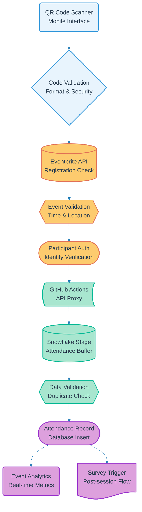

# Pipeline 10: QR Event Check-in

## Overview
Real-time event attendance tracking through QR code scanning integrated with Eventbrite registration system. Captures participant attendance data for analytics, triggers post-session workflows, and maintains accurate engagement metrics for program evaluation.

## LEGO Reference Table

| **Field** | **Value** |
|-----------|-----------|
| **Pipeline ID** | `10` |
| **Category** | Event & Survey Management |
| **Priority** | High |
| **Connects To** | `11` (Post-Session NPS Survey) |
| **Triggered By** | Authenticated participant QR scan |
| **Outputs To** | Attendance record, Event analytics, Survey trigger |

## Stack Architecture

## Definition of Done (DoD)

| **Criteria** | **Validation Method** |
|--------------|----------------------|
| **QR Code Scan** | Valid QR code successfully read |
| **Code Security** | QR format validated against tampering |
| **Event Registration** | Participant registered via Eventbrite |
| **Time Validation** | Check-in within event time window |
| **Location Check** | QR scan at correct event location |
| **Identity Verification** | Participant authentication confirmed |
| **Duplicate Prevention** | Single check-in per participant enforced |
| **Attendance Record** | Database entry created successfully |
| **Analytics Update** | Real-time metrics refreshed |
| **Survey Trigger** | Post-session workflow initiated |

## Technical Implementation Notes

### Real-time Integration
Direct integration with Eventbrite API ensures attendance tracking matches official registration data. GitHub Actions provides cost-effective API proxy while maintaining real-time responsiveness for participant experience.

### Security & Anti-fraud
QR code validation prevents tampering and replay attacks. Time and location constraints ensure attendance authenticity while duplicate detection maintains accurate headcount metrics.

### Cost-Optimized Architecture
GitHub Actions proxy pattern minimizes API costs while Snowflake Stages buffer high-frequency check-ins for batch processing. Real-time analytics balanced with economic data storage strategies.

### Error Recovery Strategy
- Invalid QR codes provide immediate feedback with scan retry guidance
- Eventbrite API failures fall back to manual registration lookup
- Network issues queue check-ins for automatic retry when connectivity restores
