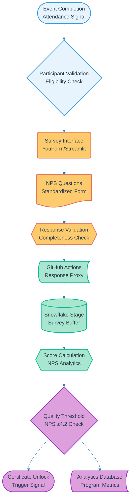

# Pipeline 11: Post-Session NPS Survey

## Overview
Mandatory NPS survey collection pipeline triggered after event completion. Implements quality gates for certificate unlock and provides critical feedback data for program improvement. Integrates with YouForm or Streamlit interface for participant experience optimization.

## LEGO Reference Table

| **Field** | **Value** |
|-----------|-----------|
| **Pipeline ID** | `11` |
| **Category** | Event & Survey Management |
| **Priority** | Very High |
| **Connects To** | `06` (Course Certification) |
| **Triggered By** | Event completion and attendance confirmation (Pipeline 10) |
| **Outputs To** | NPS score data, Certificate unlock trigger, Program analytics |

## Stack Architecture

## Definition of Done (DoD)

| **Criteria** | **Validation Method** |
|--------------|----------------------|
| **Event Completion** | Attendance confirmed via Pipeline 10 |
| **Participant Eligibility** | Valid participant with complete session |
| **Survey Access** | Interface successfully loaded |
| **Question Delivery** | All NPS questions presented |
| **Response Validation** | Complete survey submission verified |
| **Score Calculation** | NPS score computed accurately |
| **Quality Threshold** | NPS ≥4.2 validation performed |
| **Certificate Trigger** | Pipeline 06 activated on passing score |
| **Analytics Storage** | Survey data stored for program analysis |
| **Participant Notification** | Result communicated to participant |

## Technical Implementation Notes

### Mandatory Survey Completion
Survey completion is prerequisite for certificate generation, ensuring high response rates and quality feedback collection. Progressive prompting and session-based reminders maintain engagement without becoming intrusive.

### Quality-Gated Certificate Unlock
NPS threshold of 4.2 ensures only satisfied participants receive certificates, maintaining program credibility while identifying courses requiring improvement. Failed threshold triggers instructor feedback rather than participant penalty.

### Real-time Analytics Integration
Survey responses immediately contribute to program analytics for rapid course improvement cycles. Aggregate NPS trends inform curriculum development and instructor training priorities.

### Error Recovery Strategy
- Incomplete surveys save progress automatically for later completion
- Network failures queue responses for retry with offline capability
- Low NPS scores trigger constructive feedback collection for course improvement
