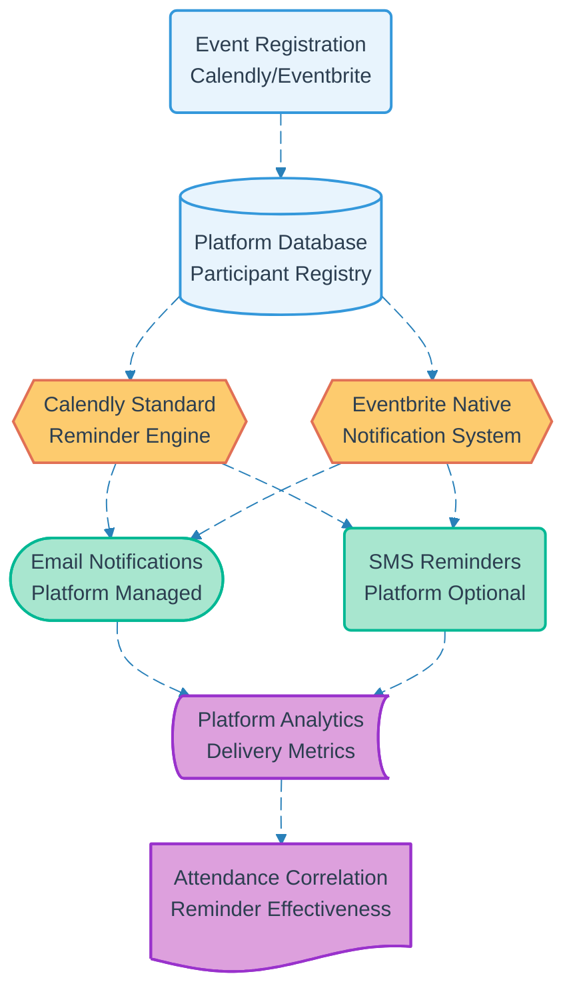

# Pipeline 12: Meeting Reminders

## Overview
Automated reminder system leveraging native platform capabilities of Calendly and Eventbrite for participant notifications. Minimal system integration required as external platforms handle reminder logic, reducing development complexity and operational overhead.

## LEGO Reference Table

| **Field** | **Value** |
|-----------|-----------|
| **Pipeline ID** | `12` |
| **Category** | Communication & Outreach |
| **Priority** | Low |
| **Connects To** | None (External platform managed) |
| **Triggered By** | Event registration on external platforms |
| **Outputs To** | Automated participant notifications, Attendance improvement |

## Stack Architecture

## Definition of Done (DoD)

| **Criteria** | **Validation Method** |
|--------------|----------------------|
| **Platform Configuration** | Calendly/Eventbrite reminder settings enabled |
| **Registration Trigger** | Participant enrollment activates reminders |
| **Email Delivery** | Platform sends automated email notifications |
| **Timing Configuration** | Reminders scheduled at optimal intervals |
| **Content Quality** | Notification messages professional and informative |
| **Delivery Tracking** | Platform analytics capture send metrics |
| **Attendance Correlation** | Reminder effectiveness measured against attendance |
| **Fallback Coverage** | Multiple reminder types ensure participant reach |

## Technical Implementation Notes

### Platform-Native Approach
Leverages mature reminder infrastructure of established platforms rather than building custom notification systems. Reduces development time, operational complexity, and maintenance overhead while ensuring reliable delivery.

### Cost-Effective Strategy
Native platform reminders included in standard subscription plans eliminate additional service costs. Avoids need for separate email service providers, SMS gateways, or notification management systems.

### Minimal System Integration
No custom development required beyond initial platform configuration. Reminder logic, delivery scheduling, and failure handling managed entirely by external platforms with proven reliability.

### Error Recovery Strategy
- Platform delivery failures handled by external service SLAs
- Multiple reminder channels (email, SMS) provide redundancy
- Manual notification capability available for critical events
