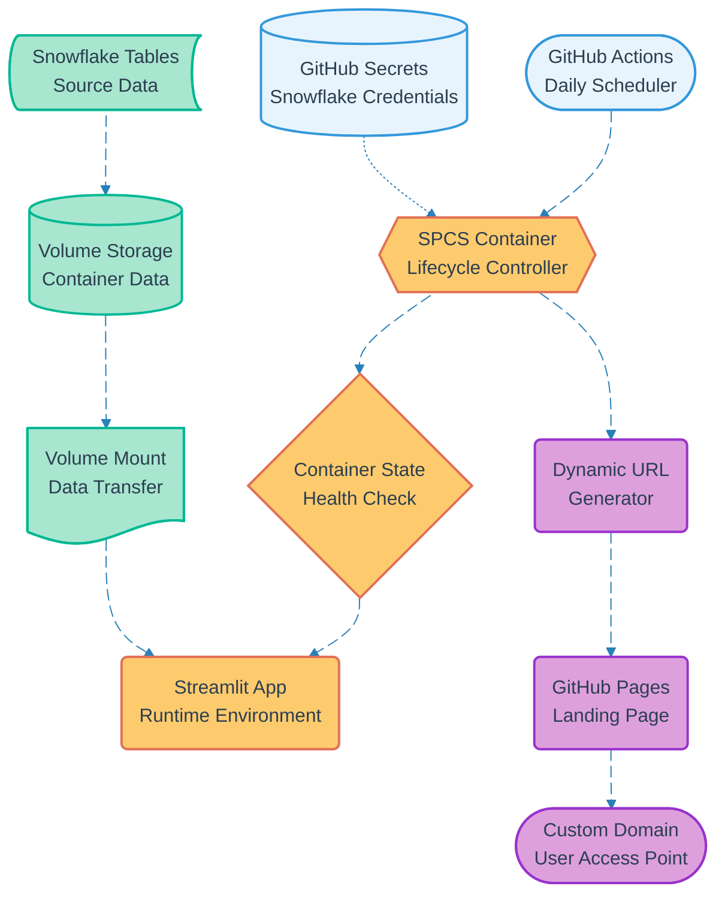

# Pipeline 13: Container Lifecycle Management

## Overview
Critical infrastructure pipeline that manages daily SPCS container startup, volume mounting, and URL management. Implements T-24h cycle to refresh container state and ensure data synchronization. Manages dynamic URL generation and landing page updates for seamless user access.

## LEGO Reference Table

| **Field** | **Value** |
|-----------|-----------|
| **Pipeline ID** | `13` |
| **Category** | Infrastructure & Data |
| **Priority** | Very High |
| **Connects To** | `01` (User Registration), `02` (Authentication), `14` (Volume Data Sync), `15` (Landing Page URL Update) |
| **Triggered By** | GitHub Actions daily schedule (T-24h) |
| **Outputs To** | SPCS Container, GitHub Pages, Volume Storage |

## Stack Architecture

## Definition of Done (DoD)

| **Criteria** | **Validation Method** |
|--------------|----------------------|
| **Daily Trigger** | GitHub Actions executes at T-24h schedule |
| **Container Startup** | SPCS container successfully initialized |
| **Volume Mount** | Fresh data loaded from Snowflake tables |
| **Health Check** | Container responds to health endpoint |
| **URL Generation** | New dynamic URL captured and validated |
| **Landing Page Update** | GitHub Pages deployed with new URL |
| **Custom Domain** | DNS routing to updated landing page |
| **Access Validation** | End-to-end user access test passes |

## Technical Implementation Notes

### T-24h Cycle Strategy
Daily container refresh ensures data consistency and security isolation. GitHub Actions scheduler triggers at off-peak hours to minimize user impact during container restart operations.

### Volume Data Synchronization
Snowflake tables export to volume storage using optimized batch queries. Volume mounting occurs during container initialization to ensure fresh data availability for Streamlit applications.

### Dynamic URL Management
Snowflake SPCS generates new URLs on each container restart for security. Landing page automatically updates with latest URL using GitHub Actions deployment pipeline to maintain seamless user experience.

### Error Recovery Strategy
- Container startup failures trigger automatic retry with exponential backoff
- Volume mount errors fall back to previous day's data snapshot
- URL update failures maintain previous working URL until resolution
