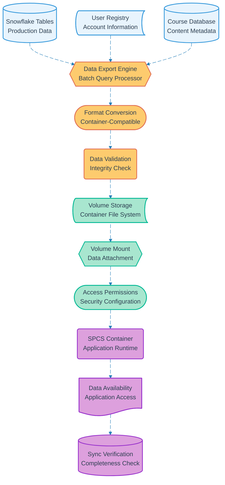

# Pipeline 14: Volume Data Sync

## Overview
Data synchronization pipeline that exports fresh data from Snowflake tables to container volumes during SPCS startup. Ensures containers have current participant, course, and operational data while maintaining cost-effective batch processing strategy.

## LEGO Reference Table

| **Field** | **Value** |
|-----------|-----------|
| **Pipeline ID** | `14` |
| **Category** | Infrastructure & Data |
| **Priority** | High |
| **Connects To** | None (Terminal data pipeline) |
| **Triggered By** | Container startup (Pipeline 13) |
| **Outputs To** | Fresh data volumes, Container data access, Application state |

## Stack Architecture

## Definition of Done (DoD)

| **Criteria** | **Validation Method** |
|--------------|----------------------|
| **Data Export** | All required tables successfully queried |
| **Format Conversion** | Data converted to container-compatible formats |
| **Integrity Validation** | Data consistency and completeness verified |
| **Volume Creation** | Container volumes successfully provisioned |
| **Mount Operation** | Volumes attached to container runtime |
| **Permission Setup** | Container access permissions configured |
| **Application Access** | Streamlit apps can read mounted data |
| **Sync Verification** | All expected data files present and accessible |
| **Performance Check** | Data loading completes within time limits |

## Technical Implementation Notes

### Batch Export Strategy
Daily batch processing minimizes Snowflake compute costs while ensuring containers have sufficiently fresh data. Export timing optimized for off-peak hours to reduce resource contention and operational costs.

### Container Isolation Pattern
Volume-based data access ensures containers cannot directly query warehouse, maintaining security boundaries while providing necessary data access. Eliminates need for database credentials in container environment.

### Data Freshness Balance
T-24h refresh cycle balances data currency requirements with cost optimization. Critical real-time data handled through separate pipelines while bulk operational data refreshed daily.

### Error Recovery Strategy
- Export failures retry with incremental data sets to isolate problematic records
- Volume mount errors fall back to previous day's data with staleness warnings
- Container access failures trigger automatic remount with permission reset
