# Pipeline 15: Landing Page URL Update

## Overview
Dynamic URL management pipeline that maintains seamless user access to SPCS containers despite URL changes on restart. Automatically updates GitHub Pages landing page with current container URL ensuring stable access point through custom domain.

## LEGO Reference Table

| **Field** | **Value** |
|-----------|-----------|
| **Pipeline ID** | `15` |
| **Category** | Infrastructure & Data |
| **Priority** | High |
| **Connects To** | None (Terminal infrastructure pipeline) |
| **Triggered By** | Container restart with new URL (Pipeline 13) |
| **Outputs To** | Updated landing page, Stable user access, DNS routing |

## Stack Architecture

```mermaid
%%{init: {'theme':'base', 'themeVariables': {'primaryColor':'#f0f8ff','primaryTextColor':'#2c3e50','primaryBorderColor':'#3498db','lineColor':'#2980b9','secondaryColor':'#e8f4fd','tertiaryColor':'#d5e8f3','background':'#ffffff','mainBkg':'#f0f8ff','secondBkg':'#e1f0ff','tertiaryBkg':'#d1e7ff'}}}%%
flowchart TD
    %% URL Detection Layer
    A@{ shape: stadium, label: "Container Restart<br/>URL Change Signal" }
    B@{ shape: hex, label: "URL Extraction<br/>Dynamic Address Capture" }
    C@{ shape: diam, label: "URL Validation<br/>Accessibility Check" }
    
    %% GitHub Integration Layer
    D@{ shape: rounded, label: "GitHub Actions<br/>Deployment Workflow" }
    E@{ shape: doc, label: "Landing Page Template<br/>HTML Structure" }
    F@{ shape: hex, label: "URL Injection<br/>Dynamic Content Update" }
    
    %% Deployment Layer
    G@{ shape: bow-rect, label: "GitHub Pages<br/>Static Site Generator" }
    H@{ shape: stadium, label: "Page Deployment<br/>Live Site Update" }
    I@{ shape: rounded, label: "DNS Propagation<br/>Custom Domain" }
    
    %% Access Layer
    J@{ shape: cyl, label: "Stable Domain<br/>User Access Point" }
    K@{ shape: doc, label: "Access Button<br/>Container Redirect" }
    L@{ shape: stadium, label: "User Experience<br/>Seamless Access" }
    
    %% URL Update Flow
    A e1@--> B
    B e2@--> C
    C e3@--> D
    D e4@--> E
    E e5@--> F
    F e6@--> G
    G e7@--> H
    H e8@--> I
    I e9@--> J
    J e10@--> K
    K e11@--> L
    
    %% Animation for Deployment Process
    e1@{ animation: fast }
    e2@{ animation: fast }
    e3@{ animation: slow }
    e4@{ animation: fast }
    e5@{ animation: fast }
    e6@{ animation: fast }
    e7@{ animation: slow }
    e8@{ animation: fast }
    e9@{ animation: fast }
    e10@{ animation: fast }
    e11@{ animation: fast }
    
    %% Styling
    classDef detection fill:#e8f4fd,stroke:#3498db,stroke-width:2px
    classDef github fill:#fdcb6e,stroke:#e17055,stroke-width:2px
    classDef deployment fill:#a8e6cf,stroke:#00b894,stroke-width:2px
    classDef access fill:#dda0dd,stroke:#9932cc,stroke-width:2px
    classDef critical stroke-dasharray: 5,5,stroke-dashoffset: 10,animation: dash 2s linear infinite
    
    class A,B,C detection
    class D,E,F github
    class G,H,I deployment
    class J,K,L access
    class e3,e7 critical
```

## Definition of Done (DoD)

| **Criteria** | **Validation Method** |
|--------------|----------------------|
| **URL Detection** | New container URL successfully captured |
| **URL Validation** | Container accessibility verified |
| **Template Loading** | GitHub landing page template retrieved |
| **URL Injection** | Dynamic URL correctly inserted into template |
| **GitHub Pages Deploy** | Static site successfully regenerated |
| **DNS Propagation** | Custom domain resolves to updated page |
| **Access Button** | Button correctly redirects to container |
| **End-to-End Test** | Complete user journey validated |
| **Fallback Handling** | Error states gracefully managed |

## Technical Implementation Notes

### Seamless User Experience
Maintains consistent access point for users despite underlying infrastructure changes. Custom domain provides professional interface while GitHub Pages handles reliable static hosting at zero additional cost.

### Automated Update Pipeline
GitHub Actions workflow automatically triggers on container restart events, eliminating manual intervention requirements. Template-based approach enables rapid deployment while maintaining design consistency.

### Fallback Strategy
Landing page includes fallback instructions and alternative access methods in case of deployment issues. Previous working URL maintained until successful validation of new URL accessibility.

### Error Recovery Strategy
- URL validation failures maintain previous working page with status notifications
- GitHub Pages deployment issues fall back to direct URL sharing with manual instructions
- DNS propagation delays handled with immediate IP-based access options
