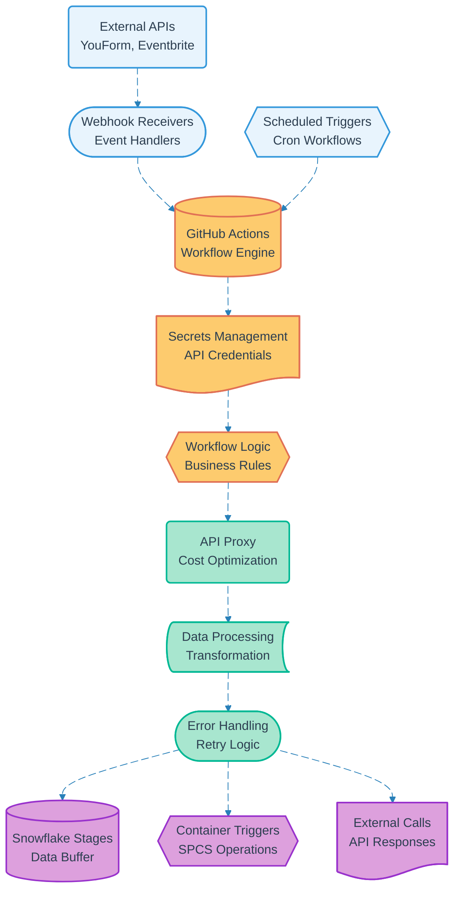

# Pipeline 16: GitHub Workflow Orchestration

## Overview
Central API proxy and workflow orchestration system that manages all external integrations through GitHub Actions. Implements cost-optimized pattern for API calls while providing unified webhook handling, data staging, and error management across all system pipelines.

## LEGO Reference Table

| **Field** | **Value** |
|-----------|-----------|
| **Pipeline ID** | `16` |
| **Category** | Infrastructure & Data |
| **Priority** | High |
| **Connects To** | All pipelines (Universal dependency) |
| **Triggered By** | API webhooks, scheduled events, manual triggers |
| **Outputs To** | Snowflake stages, Container deployments, External API calls |

## Stack Architecture

## Definition of Done (DoD)

| **Criteria** | **Validation Method** |
|--------------|----------------------|
| **Webhook Reception** | External API events successfully captured |
| **Workflow Execution** | GitHub Actions runs complete successfully |
| **Secret Access** | API credentials securely accessed |
| **API Proxy Function** | External calls routed through GitHub |
| **Data Transformation** | Input data processed to required formats |
| **Error Handling** | Failed operations properly managed |
| **Stage Upload** | Data successfully written to Snowflake |
| **Container Triggers** | SPCS operations initiated correctly |
| **Response Delivery** | External API responses handled |
| **Cost Optimization** | API usage within budget parameters |

## Technical Implementation Notes

### Universal API Proxy
GitHub Actions serves as cost-effective proxy for all external API interactions, eliminating need for dedicated API gateway services. Free tier provides substantial API call allowances while maintaining professional reliability standards.

### Centralized Secret Management
GitHub Secrets provides secure credential storage for all external service integrations. Unified management reduces security surface area while enabling audit trail for all API access patterns.

### Cost-Optimized Architecture
Batch processing and strategic API call timing minimizes external service costs. Snowflake Stages used as buffer layer to reduce expensive real-time database operations while maintaining data freshness.

### Error Recovery Strategy
- Webhook failures trigger automatic retry with exponential backoff
- API proxy errors fall back to direct integration with cost tracking
- Workflow execution failures queue for manual review with detailed logging
