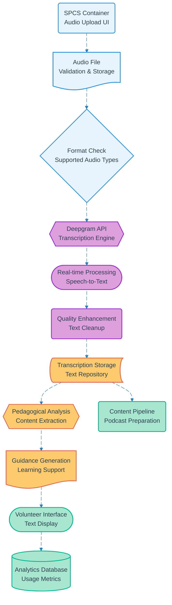

# Pipeline 17: Audio Processing Deepgram

## Overview
AI-powered audio transcription pipeline using Deepgram API to convert volunteer guidance audio into text for pedagogical support. Processes uploaded audio files through SPCS container interface and provides real-time transcription for course delivery enhancement.

## LEGO Reference Table

| **Field** | **Value** |
|-----------|-----------|
| **Pipeline ID** | `17` |
| **Category** | AI Processing |
| **Priority** | Medium |
| **Connects To** | `19` (Podcast Generation Jellypod) |
| **Triggered By** | Authenticated volunteer audio upload |
| **Outputs To** | Text transcription, Pedagogical guidance, Podcast content |

## Stack Architecture

## Definition of Done (DoD)

| **Criteria** | **Validation Method** |
|--------------|----------------------|
| **Audio Upload** | File successfully uploaded to container storage |
| **Format Validation** | Audio format supported by Deepgram API |
| **API Integration** | Deepgram service responds successfully |
| **Transcription Quality** | Text output meets accuracy standards |
| **Content Processing** | Pedagogical guidance extracted |
| **Text Storage** | Transcription saved to repository |
| **Volunteer Access** | Text displayed in container interface |
| **Pipeline Trigger** | Podcast generation workflow activated |
| **Analytics Capture** | Usage metrics recorded |

## Technical Implementation Notes

### Real-time Transcription
Deepgram's advanced speech recognition provides high-accuracy transcription with speaker identification and punctuation. Optimized for educational content with technical vocabulary recognition capabilities.

### Pedagogical Enhancement
AI-processed transcriptions analyzed for educational value extraction. Generates structured guidance materials from informal audio recordings to support volunteer course delivery.

### Cost-Effective Processing
Pay-per-use Deepgram pricing with optimized audio preprocessing to minimize API costs. Batch processing capabilities for non-urgent transcription requirements.

### Error Recovery Strategy
- Audio format issues trigger conversion with format guidance
- API failures queue for retry with fallback to manual transcription
- Quality issues prompt re-upload with recording improvement suggestions
