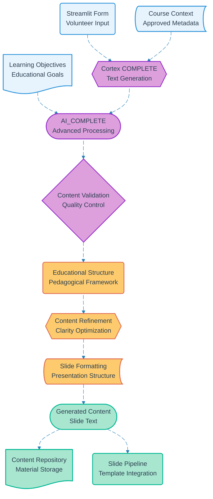

# Pipeline 18: Cortex AI Content Generation

## Overview
Snowflake Cortex AI-powered content generation pipeline using COMPLETE and AI_COMPLETE functions to transform volunteer form inputs into educational slide content. Integrates with course proposal data to create contextually appropriate learning materials.

## LEGO Reference Table

| **Field** | **Value** |
|-----------|-----------|
| **Pipeline ID** | `18` |
| **Category** | AI Processing |
| **Priority** | Medium |
| **Connects To** | `07` (Course Slides Generation) |
| **Triggered By** | Authenticated volunteer form submission |
| **Outputs To** | AI-generated content, Slide text, Educational materials |

## Stack Architecture

## Definition of Done (DoD)

| **Criteria** | **Validation Method** |
|--------------|----------------------|
| **Form Completion** | All required volunteer inputs captured |
| **Context Loading** | Course metadata successfully retrieved |
| **AI Function Call** | Cortex COMPLETE/AI_COMPLETE responds |
| **Content Generation** | Coherent slide text produced |
| **Quality Validation** | Generated content meets educational standards |
| **Structure Application** | Pedagogical framework applied |
| **Content Refinement** | Text optimized for clarity and engagement |
| **Slide Formatting** | Content structured for presentation |
| **Repository Storage** | Generated materials saved |
| **Pipeline Integration** | Slide generation workflow triggered |

## Technical Implementation Notes

### Native Snowflake AI
Leverages built-in Cortex AI capabilities eliminating external AI service costs and complexity. COMPLETE and AI_COMPLETE functions provide sophisticated text generation with educational context awareness.

### Educational Content Optimization
AI prompts specifically tuned for educational content generation with appropriate reading levels, learning progression, and pedagogical structure. Maintains consistency with approved course objectives.

### Cost-Effective AI Processing
Snowflake Cortex AI pricing integrated with existing warehouse costs. No additional AI service subscriptions or API limits to manage while providing enterprise-grade content generation.

### Error Recovery Strategy
- AI generation failures fall back to template-based content with manual editing prompts
- Quality validation issues trigger regeneration with refined prompts
- Content formatting errors provide fallback to basic text structure
