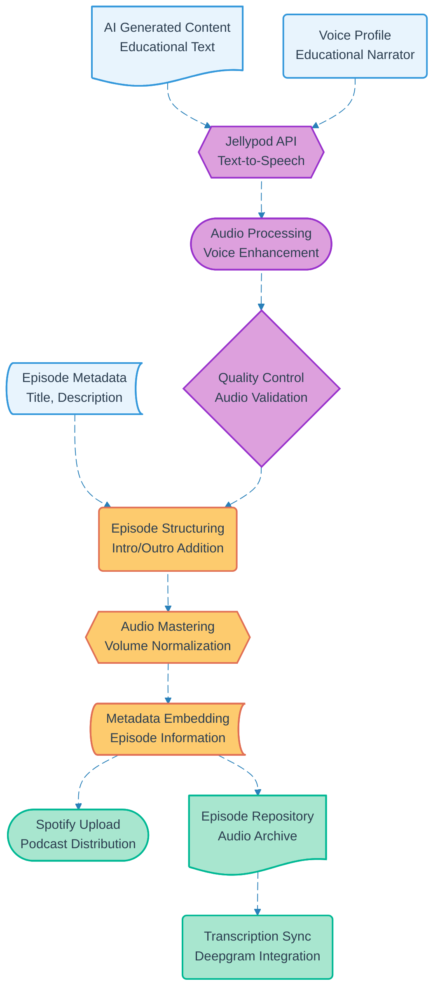

# Pipeline 19: Podcast Generation Jellypod

## Overview
Jellypod service integration pipeline converting AI-generated educational content into professional podcast episodes. Utilizes text-to-speech technology with educational voice profiles to create engaging audio content for Spotify distribution.

## LEGO Reference Table

| **Field** | **Value** |
|-----------|-----------|
| **Pipeline ID** | `19` |
| **Category** | Media Processing |
| **Priority** | Medium |
| **Connects To** | `18` (Cortex AI Content Generation), `17` (Audio Processing Deepgram) |
| **Triggered By** | Completed AI content generation |
| **Outputs To** | Podcast episodes, Spotify platform, Audio transcriptions |

## Stack Architecture

## Definition of Done (DoD)

| **Criteria** | **Validation Method** |
|--------------|----------------------|
| **Content Input** | AI-generated text successfully received |
| **Voice Selection** | Educational voice profile applied |
| **Jellypod Processing** | Text-to-speech conversion completed |
| **Audio Quality** | Generated audio meets broadcast standards |
| **Episode Structure** | Intro/outro segments properly integrated |
| **Audio Mastering** | Volume levels normalized and enhanced |
| **Metadata Embedding** | Episode information properly tagged |
| **Spotify Upload** | Podcast episode published to platform |
| **Archive Storage** | Episode backed up in repository |
| **Transcription Sync** | Audio synchronized with Deepgram pipeline |

## Technical Implementation Notes

### Jellypod Integration
Professional text-to-speech service with educational voice profiles optimized for learning content. Provides natural-sounding narration with appropriate pacing and emphasis for instructional material.

### Automated Episode Production
Complete podcast episode production workflow from text input to Spotify publication. Includes automated intro/outro insertion, audio mastering, and metadata management for consistent episode quality.

### Cost-Optimized Audio Processing
Jellypod service pricing based on text length processed. GitHub Actions orchestration minimizes processing costs by batching episode generation and optimizing API calls.

### Error Recovery Strategy
- Jellypod API failures retry with exponential backoff and alternative voice profiles
- Audio quality issues trigger regeneration with enhanced processing parameters
- Spotify upload failures fall back to manual upload queue with admin notification
