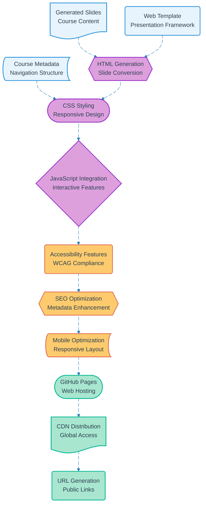

# Pipeline 20: Slide Web Publication

## Overview
Web publication pipeline for AI-generated educational slides using GitHub Pages or similar hosting. Converts slide content from course generation pipeline into responsive web presentations with interactive navigation and accessibility features.

## LEGO Reference Table

| **Field** | **Value** |
|-----------|-----------|
| **Pipeline ID** | `20` |
| **Category** | Web Publishing |
| **Priority** | High |
| **Connects To** | `07` (Course Slides Generation), `18` (Cortex AI Content Generation) |
| **Triggered By** | Completed slide generation |
| **Outputs To** | Public web slides, Course materials, Learning resources |

## Stack Architecture

## Definition of Done (DoD)

| **Criteria** | **Validation Method** |
|--------------|----------------------|
| **Slide Input** | Generated content successfully received |
| **Template Loading** | Web presentation framework applied |
| **HTML Generation** | Slide content converted to web format |
| **Responsive Design** | CSS styling renders correctly across devices |
| **Interactive Features** | Navigation and interactive elements functional |
| **Accessibility Compliance** | WCAG guidelines met for inclusive access |
| **SEO Optimization** | Search engine metadata properly configured |
| **Mobile Compatibility** | Presentation optimized for mobile devices |
| **GitHub Deployment** | Site successfully published to GitHub Pages |
| **CDN Distribution** | Content delivered via global CDN |
| **URL Accessibility** | Public links generated and validated |

## Technical Implementation Notes

### GitHub Pages Integration
Leverages free GitHub Pages hosting with automated deployment through GitHub Actions. Provides reliable web hosting with custom domain support and SSL certificates for professional presentation delivery.

### Responsive Web Design
Mobile-first approach ensures slides render effectively across devices. Touch-friendly navigation for tablets and smartphones with keyboard accessibility for desktop users.

### Cost-Free Web Hosting
GitHub Pages provides unlimited bandwidth and hosting at no cost. CDN distribution through GitHub's infrastructure ensures global accessibility without additional hosting expenses.

### Error Recovery Strategy
- HTML generation failures fall back to simplified slide templates with manual editing options
- CSS rendering issues provide graceful degradation to basic styling
- GitHub Pages deployment failures trigger alternative hosting solutions with admin notification
