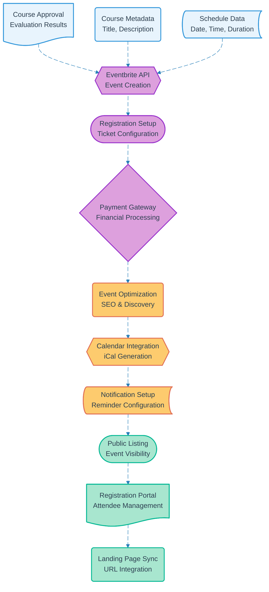

# Pipeline 21: Eventbrite Event Creation

## Overview
Automated Eventbrite event creation pipeline triggered by course approval workflow. Creates public event listings with registration management, payment processing, and calendar integration for approved educational courses.

## LEGO Reference Table

| **Field** | **Value** |
|-----------|-----------|
| **Pipeline ID** | `21` |
| **Category** | Event Management |
| **Priority** | High |
| **Connects To** | `05` (Course Proposal Evaluation), `15` (Landing Page URL Update) |
| **Triggered By** | Course approval notification |
| **Outputs To** | Public event listings, Registration system, Payment gateway |

## Stack Architecture

## Definition of Done (DoD)

| **Criteria** | **Validation Method** |
|--------------|----------------------|
| **Approval Input** | Course approval data successfully received |
| **Metadata Loading** | Course information properly formatted |
| **Schedule Integration** | Date and time data validated |
| **Event Creation** | Eventbrite event successfully generated |
| **Registration Setup** | Ticket types and pricing configured |
| **Payment Processing** | Financial gateway integration functional |
| **SEO Optimization** | Event discoverable through search |
| **Calendar Integration** | iCal files generated for attendee calendars |
| **Notification Configuration** | Automated reminders properly scheduled |
| **Public Visibility** | Event listed and accessible to public |
| **Registration Portal** | Attendee management system operational |
| **Landing Page Sync** | Event URL integrated with course landing page |

## Technical Implementation Notes

### Eventbrite API Integration
Professional event management platform with robust API for automated event creation, ticket sales, and attendee management. Provides payment processing, refund handling, and comprehensive analytics.

### Automated Registration Management
Complete ticket sales workflow with pricing tiers, capacity management, and waitlist functionality. Supports multiple payment methods and automated confirmation emails.

### Cost-Effective Event Marketing
Eventbrite provides marketing tools and event discovery features included in platform fees. No additional marketing software required while maintaining professional event presentation.

### Error Recovery Strategy
- Eventbrite API failures retry with exponential backoff and alternative configuration parameters
- Payment gateway issues provide fallback to manual payment processing with admin notification
- Registration capacity errors trigger overflow event creation with linked registration management
